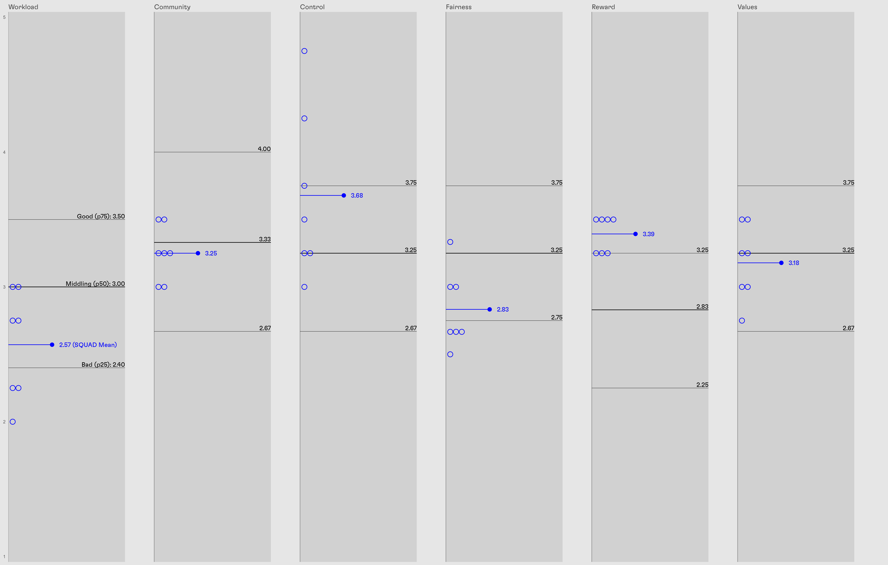

# AWS / MBI SQUAD Pilot Notes

## AWS 

```{r}

```

### Workload

#### Background

Maslach and Leiter summarize the workload scale as follows: 

> The amount of work to be done in a given time. A manageable workload 
provides the opportunity to do what one enjoys, to pursue career 
objectives, and to develop professionally. A crisis in workload is not a 
matter of simply stretching to meet a new challenge, but of going beyond 
human limits.

The relationship between a person or team's workload and their outcomes
is intuitive. Overburdened people are more likely to produce shoddy work, 
have less space to develop their skills, and are therefore at a much higher 
risk of disengagement and burnout. We want high scores on Workload because 
we need time and space to learn, adapt, and grow as an organization. 

During my first year as a manager, I worked explicitly to 'rationalize workloads'
across the team by trying to simplify individual portfolios, reduce or mitigate potential 
accountability conflicts, and resist the accumulation of boundless commitments.
Qualitatively, this felt like it worked for each individual to the degree that 
I had control over the projects and work coming into their portfolios. I expected
to see a roughly even split between acceptable and bad workloads across the SQUAD. 

#### What do I see here? 

Workload on the SQUAD is, overall, still quite bad. Our average (2.57) sits 
just above the 25th percentile benchmark (2.4). Four of you sit above that average, 
with two actually having a median workload score. The three others are not only below
the SQUAD mean, but below the 25th percentile benchmark. 

This split, which I would cautiously call a mixed success, roughly aligns with my expectations. 
Some SQUADDERs are doing OK, while others are still overwhelmed. 
My efforts in this area have worked in a positive direction, but there's still 
a lot of hill left to climb. 


#### Where are we headed?

The nature of our work and organization imposes a number of structural risks to a healthy workload. 
Planning is hard and we're bad at it. The clients to whom we are beholden can bring indecision, self-interest, 
and caprice. Unknowable unknowns abound. Over the next year, I'd like to see our overall workload score 
shift upward, but my primary concern is raising the floor, increasing the minimum Workload score 
to at least the 25th percentile benchmark. Mediocrity for all!

Over the next year, I'm going to keep pushing in the same way where it's been working, 
but I'm not sure what to do in situations where it hasn't. Before seeing these numbers, 
I had planned to get more aggressive with tracking overtime and material workload, but 
I'm hoping that the growth of Blueprint's planning and allocation processes 
opens up new vectors of attack for the dire situations that persist. 

By the end of Q4, Bluerpint's StratOps department will publish formal guidelines for 
resource allocation, work-planning, and time tracking. Leadership is currently marinating
on the ideal balance between cashflow and burden. This strategic judgement call will beget
margin and utilization targets. These may help, but there's substantial uncertainty around
where they will end up and what they will mean. 

#### What does it mean for you?

I am broadly open to ideas and grateful for advice, both on your personal workload and 
the SQUAD's as a whole. I know from personal experience that improving one's workload at 
Blueprint is itself a lot of personal work, and I anticipate that reality will persist. 
If your workload is still fucked, I'm here to help but, for better or worse, I will need some 
strategic and tactical energy from you. 

### Community

#### Background

Maslach and Leiter summarize the Community scale as follows: 

> The quality of an organization’s social environment. People thrive in 
communities characterized by support, collaboration, and positive 
feelings. Mismatches occur when there is no sense of positive connection 
with others at work

The perils of isolation, and corresponding value of community were made clear to me from the 
start of my management role. Blueprint has always powered through challenging work and 
chaotic process with the strength of the ties that bind its people together, but 
our growth and the pandemic have made fostering those connections harder. 

On the suggestion of various SQUADDERs, I instituted SQUAD scrum. We had a drink in the 
park, and will have a BBQ at Conor's place in the spring. I have also tried to encourage and make
space for extracurricular collaboration on process innovation and skills development. 
From my observations, it feels like these have helped, and at least mitigated some of the 
damage to sense of community that comes with growth and forever lockdown. 

#### What do I see here? 

As a SQUAD, our Community score mean (3.25) sits just below the benchmark median (3.33).
Individual scores are all within one item point of one another, which implies a general 
consensus about the strength of Community within our group.  
Given the circumstances, I think this represents a meaningful accomplishment. 
The benchmarks that I'm using here were calibrated prior to the pandemic, in 
Universities and Hospitals, where I would intuitively expect Community to be 
strong, relative to consultancies at least. 
These results align with my cautiously optimistic expectations. 

#### Where are we headed?

Community is the glue that holds our society together. A strong community makes 
otherwise insurmountable challenges tractable. It can transform situations from 
stressful to joyful. It motivates and inspires. It also takes time, as 
people within the community build their relationships, trust with one another, 
and bank shared experiences to draw on. I would like to see our Community score continue 
to rise steadily over the coming year. I will call it a success if everyone is above the 
median benchmark. 

Seeing these results hasn't convicted me to change the direction or spirit of my 
approach. It has, rather, energized me to continue finding opportunities for 
informal connections, team building, and positive collaboration. 

#### What does it mean for you?

Over the next year, I will be on the lookout for such opportunities, and
I'll be relying on all of you to speak up when you have one, engage with the 
ideas on the table, and join me in working toward a stronger, happier, healthier 
community. 


### Control

#### Background

Maslach and Leiter summarize the Community scale as follows: 

> The opportunity to make choices and decisions, to solve problems, and to 
contribute to the fulfillment of responsibilities. A good match occurs when 
there is a correspondence between control and accountability. A 
mismatch occurs when people lack sufficient control to fulfill the 
responsibilities for which they are accountable.

Control is the dimension along which I have worked most intentionally
over the past year. I have tried to do the following:

- Delegate problems, not solutions
- Give you ownership of solution design and execution
- Create direct accountability between you and the client
- Offer help, suggest options, but defer to your judgement on how it should work
- Supportively reflect on situations that didn't work as intended
- Eliminate information bottlenecks that prevent strategic thinking

I expected to see generally high values across the board for Control.
I spent last year delegating Control so aggressively by necessity. 
I felt comfortable doing it because,  
regardless of your title, you are here at Blueprint and here on my team 
because you are bright, effective, and motivated. 

#### What do I see here? 

As expected, the team average (3.68) is high, approaching the individual 75th percentile 
mark (3.75). This is great, and reinforces my belief in more decentralized ownership of 
problems, solutions, and relationships. The individual scores for Control 
cover the widest range of any of the scales measured, 
from extremely high (4.75) on the high end, to slightly below average (3.00) on the low end. 

#### Where are we headed?

I want the future to be one where every single one of you feels in control of the
way they do their work. I want you to experience the impact of your work 
knowing that your choices drove it. Over the next year, I want each squadder's 
control score to rise above the median benchmark (3.25). 

I am confident in this outcome. The feeling of control should naturally rise
as we get more experience together, and as I continue to enhance my management 
and leadership toolkits. 

Rather than focusing on increasing control, I'm going to focus on increasing 
support and alignment. With the control that I've given you, you've 
done great things: execution and improvement of PDI, better project management 
habits, the whole dang CMHC project, the DAGs and Collabovation. 
However, there have been moments like SCSP, the NGBI Phase 1 report, and PDI Capacity Building Plans 
where autonomy has turned to isolation, and created misery. 

Over the next year, I am going to try desperately to avoid situations like 
that NOT BY TAKING AWAY CONTROL, but by planning more transparently, 
clarifying context more proactively, and doing more to create a culture of 
mutual accountability. 

#### What does it mean for you?

Expect me to be trying out different ways of supporting more directly and intentionally. 
Give me feedback on what I'm doing. Am I doing enough? Am I micromanaging? Am I putting 
distance between you and your ownership of the outcomes of your work?
What could I do differntly, and how would it make things better? 

### Fairness

#### Background

- What does this scale mean? 
- What have I done over the past year that lines up here? 
- What did I expect to see now, and why? 

Maslach and Leiter summarize the Fairness scale as follows: 

> The extent to which the organization has consistent and equitable rules 
for everyone. An important element is the extent to which resources are 
allocated according to generally understood and consistent procedures. 
Fairness communicates respect for the members of an organization’s 
community. A lack of fairness indicates confusion in an organization’s 
values and in its relationships with people. 

I have not worked intentionally on increasing the fairness of our organization 
over the past year, excepting places where I have advocated for 
transparency and clear process. Within our team, the extremely varied
portfolios make it difficult to assess what is fair. I think I am 
being fair in the opportunities I present, the way that I present them, 
and the way that I evaluate results, but doesn't everyone? 

There were a number of questions from y'all about this scale in particular 
as you were filling out the survey, which tell me that there is a 
difference between the feeling of fairness within our team and 
across our organization. I expected to see low scores here on that 
account. Scores that reflect the same sentiments articulated in the 
DEI report, where favouritism and in-group bias were highlighted 
as key issues. 

#### What do I see here? 

As a team, we (2.83) sit closer to the p25 (2.75) benchmark than we do to the median (3.25). 
Three individual scores are above the team average, but only one rises above the median. 
The four below are all below p25.
This aligns with my expectation, though it is depressing to see it quantified. 
I'm not surprised. I'm not happy. Obviously this is problem. 

#### Where are we headed?

I'd like to see these scores rise, but I'm not sure what's reasonable. 
I am going to continue pushing for clarity in process where I can, 
and advocating for people who I see as being treated unfairly. 
I will try to make stretch opportunities more transparent and 
available, and continue examining my own behaviour, but 
I need help knowing what else to do. 

Blueprint is moving in fits and starts toward clarity of process
and structural accountability, but it's going to take time.
Broadly, I think we're trending toward more fairness, but slowly. 

#### What does it mean for you?

Increasing fairness is a difficult task, and conversations about
fairness can be really challenging and painful. I don't know what 
to ask from you, except to encourage you to call out instances of 
unfairness that you see, when and where you feel comfortable doing so. 

### Reward

#### Background

- What does this scale mean? 
- What have I done over the past year that lines up here? 
- What did I expect to see now, and why? 

Maslach and Leiter summarize the Reward scale as follows: 

> Recognition—financial and social—for contributions on the job. A 
meaningful reward system acknowledges contributions to work and 
provides clear indications of what the organization values. People 
experience a lack of recognition as devaluing their work and themselves.

In any kind of relationship, I am instinctively and reflexively encouraging. 
My aim is to create a constant stream of positive reinforcement and 
gratitude that affirms showing up and being yourself, and celebrates 
everything above and beyond that. It feels like everyone else on the team
is like that as well. 

I have helped secure promotions for Conor, Alberta, and Per, and an 
Associate reclassification for Samridhi. In terms of raises, I have 
pushed for generosity to the extent allowed by our framework, and 
sometimes beyond. 

I expected, therefore, to see a high score on the Reward scale. 

#### What do I see here? 

- Where do we sit wrt the benchmark distribution? 
- How spread out are individual SQUADDER scores? 
- How does this relate to my expectations? 

The Reward is strong in you, young padawans. Individual Reward scores
are tightly grouped around the team mean (3.39), and each one 
sits at or above the p75 benchmark of 3.25. This is even better 
than I expected, and I'm thrilled to see this result. To me, 
these scores say that the culture we've set up on our team 
is working to make people feel recognized, celebrated, and 
compensated for their work. 


#### Where are we headed?

- Where are we trying to get to? 
- What am I going to try to do differently?
- What is changing at Blueprint that might affect this going forward? 

I want to keep it up. I want you each to keep feeling like 
you get credit where you deserve it, and keep looking for 
opportunities to be generous with your gratitude and praise. 
I like the vibe. I need the vibe. I'm open to suggestions, but 
mostly I think we should be patting ourselves and eachother 
on the backs. 


### Values

#### Background

- What does this scale mean? 
- What have I done over the past year that lines up here? 
- What did I expect to see now, and why? 

Maslach and Leiter summarize the Community scale as follows: 

>  Values are what is important to the organization and to its members. 
When organizational and personal values are congruent, successes are 
shared. Mismatches occur when differences exist between an 
organization’s values and the values of its staff, or if the organization 
does not practice its stated values

Values are what tie us together. They let us make decisions
individually that work toward a shared vision of the future. 
Alignment between the values you hold and the values we share 
is key for acting with collective intention and distributed control. 

Blueprint's values have always been tough to pin down, because there are 
different sets of them. There are the values that we list on our 
website, the values that Leadership uses to run the organization, 
and the values that we apply when we're working together. 

Long story short, I didn't know what to expect, since the 
questions could be interpreted variously. 


#### What do I see here? 

- Where do we sit wrt the benchmark distribution? 
- How spread out are individual SQUADDER scores? 
- How does this relate to my expectations? 

As a team, our Values score (3.18) is close to the benchmark median (3.25). 
We're doing ok here in spite of some percieved conflicts between Blueprint's 
values and the way our org works. Individual scores on this scale range from 
just above bad to just below good, and overall, I'm not really sure what to make of it. 

The score is higher than I expected, I guess? I figured that our corporate 
values are so abstract that it's tough to know what they mean, and the 
emergent sets of values are not clearly articulated, so tough to know how 
you relate to those. 

#### Where are we headed?

- Where are we trying to get to? 
- What am I going to try to do differently?
- What is changing at Blueprint that might affect this going forward? 

I feel like more values alignment is a good thing, so I'd like to see this grwo. 

#### What does it mean for you?